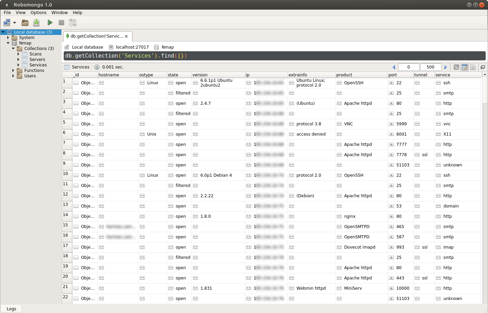

# Nmap to MongoDB


### Description

Basic tool to import Nmap XML report to mongodb.


### Usage

Usage example:
```sh
user@ubuntu:~/nmap-to-mongo$ python3 ./nmaptomongo.py -F /tmp/nmap/ -d

-------------------
~ Nmap to MongoDB ~
-------------------

Drop database "Nmap" [y/N]: y
Database "Nmap" dropped

File(s) parsed:
 - /tmp/nmap/nmap_1**.***.**.**_29.xml
 - /tmp/nmap/nmap_1**.***.**.**_28.xml
 - /tmp/nmap/nmap_1**.***.**.**_28.xml
 - /tmp/nmap/nmap_1**.***.**.**_27.xml

Parsed to database "Nmap"
```

Arguments:
```sh
Nmap to MongoDB

optional arguments:
  -h, --help            show this help message and exit
  -f FILE, --file FILE  Nmap XML report
  -F FOLDER, --folder FOLDER
                        Nmap XML folder reports
  -d, --drop            Drop existing database and create new
  --host HOST           MongoDB host
  --port PORT           MongoDB port
  --database DATABASE   MongoDB database
```


### Result




### Requirements

Python libs required:
* [pymongo](https://github.com/mongodb/mongo-python-driver)

Install:
```sh
python3 -m pip install pymongo
```
